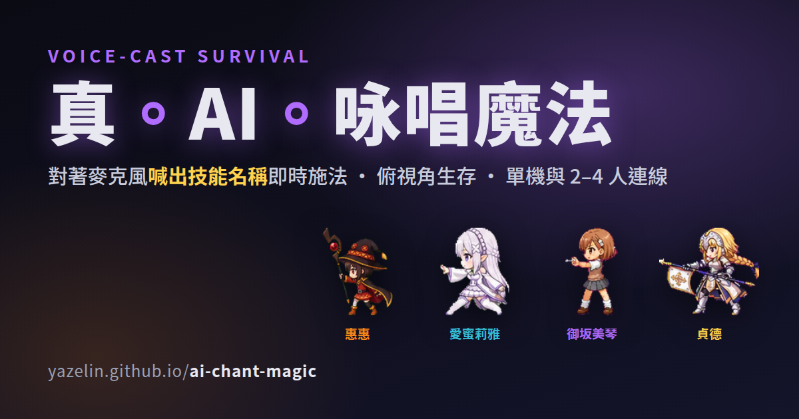

# 真。AI。咏唱魔法



俯視角網頁小遊戲:WSAD/方向鍵移動、滑鼠瞄準,**用麥克風喊出技能名稱**即時施法。
單機可玩,也支援 **2-4 人連線 co-op**(權威伺服器)。四位動漫風魔法少女各有專屬技能:
**惠惠**(炎術士)、**愛蜜莉雅**(冰精靈)、**御坂美琴**(電擊使)、**貞德**(守護者)。

**▶ 線上即玩**:https://yazelin.github.io/ai-chant-magic/ — 可單機,也可直接開房 2-4 人連線;連線伺服器已部署在 Render 免費方案,閒置會休眠、首次連線冷啟動可能要 1-2 分鐘(遊戲內有即時等待秒數,不是當機)。

- 首頁就是**詠唱練習場**:四角色卡列出技能效果/數值(hover 看詳細),開麥克風對著它練喊;每招**詠唱詞可自訂**(改了練習 + 遊戲都生效)
- 客戶端純前端(GitHub Pages),多人連線靠一台 Node WebSocket 伺服器 —— 已部署在 Render(本機開發則連 `localhost`)
- 語音用瀏覽器內建 Web Speech API —— **請用 Google Chrome 或 Edge**;不支援/辨識失效時自動切到 Groq(whisper-large-v3-turbo)備援(`cloudflare/voice-proxy/`),兩者都需要網路。沒有語音時,畫面下方技能按鈕可直接點按施法(這也是唯一離線可用的施法方式)
- 別看每個角色只有 3 招,深層系統不少:職業羈絆加成、元素反應連段、共鳴詠唱團隊技、4 章打穿解鎖無盡模式、每週限時排行榜——細節見下面對應章節

## 快速開始(本機,含兩分頁連線試玩)

```bash
npm install
npm run dev          # 同時起 server(ws://localhost:8787)與 client(Vite)
```

開瀏覽器到 Vite 印出的網址(通常 http://localhost:5173 )。

- **單機**:選職業 → 單機,直接玩。
- **兩人連線(同機測試)**:開兩個分頁 → 分頁 A「建立房間」拿到代碼 → 分頁 B「輸入代碼加入」→ 各選職業 → 房主按開始。
- 沒有麥克風也能測:遊戲中按 **1 / 2 / 3** 施放當前職業的三個法術;真 Chrome 下可直接用語音喊法術名。

> 兩分頁連線請在 **Vite dev(http)** 下測;不要用 HTTPS 的 Pages 頁面連 `ws://localhost`(瀏覽器會擋)。

## 操作

- 移動:WSAD / 方向鍵
- 面向:滑鼠(法術朝面向發出)
- 施法:喊法術名,或喊你自訂的詠唱詞(每招可在首頁練習場各自設定);或按 1/2/3
- 倒地:被怪打趴會倒地,隊友站旁邊會自動把你救起;沒人救到、流血計時結束會陣亡,下一波開始時復活
- 共鳴:2 人以上在短時間內各自喊出「共鳴」(或「共鳴詠唱」/「同心協力」/resonance/echo,或按 `4`),不用喊得一字不差、也不用真的同步,只要都落在 1.5 秒內就觸發全隊護盾+持續回血,20 秒冷卻;單人模式沒有隊友能同步,用不到
- 重來:`R`

## 角色與技能

| 角色(職業) | 三招 | 定位 |
|---|---|---|
| 惠惠 — 炎術士 | **黑暗 / 深淵**(無冷卻,各 +1 爆裂充能)→ **爆裂魔法**(需 ≥1 充能;傷害/範圍隨層數放大、放完清空、冷卻隨層數變長) | 無限蓄力的一發大爆;蓄力時畫面會逐句吐出原作詠唱彩蛋 |
| 愛蜜莉雅 — 冰精靈 | **冰柱魔線**(三連冰錐、命中減速)/ **絕對零度**(自身範圍完全凍結)/ **精靈自癒**(自身持續回血) | 控場減速 + 凍結 + 自補 |
| 御坂美琴 — 電擊使 | **超電磁砲**(貫穿雷射、撞牆反彈)/ **落雷**(連鎖閃電最多跳 4 個)/ **鐵砂之劍**(近距傷害 + 擊退) | 直線穿透 + 連鎖清場 + 解圍 |
| 貞德 — 守護者 | **聖光**(自身範圍)/ **聖盾**(全隊護盾)/ **治療術**(全隊持續回血) | 團隊輔助續航,全隊防護由她包辦 |

人越多,怪潮越瘋狂(超線性);治療/護盾對範圍內**存活**隊友(含自己)生效。技能名是預設「詠唱詞」,可在首頁逐招改成你順口的短詞。

**職業羈絆**:場上出現不同職業會疊加技能威力加成,每組不重複配對 +8%(2 種職業組隊 = 1 組 +8%、3 種 = 3 組 +24%、4 種全上 = 6 組 +48%);同職業組隊或單人不會觸發:

| 配對 | 羈絆名 |
|---|---|
| 惠惠 × 愛蜜莉雅 | 冰火相濟 |
| 惠惠 × 御坂美琴 | 雷炎共振 |
| 惠惠 × 貞德 | 庇護烈焰 |
| 愛蜜莉雅 × 御坂美琴 | 凍雷交織 |
| 愛蜜莉雅 × 貞德 | 冰霜壁壘 |
| 御坂美琴 × 貞德 | 雷光聖盾 |

## 元素反應

技能命中會讓怪物短暫附著該元素(4 秒內有效),這段時間內再被**不同**元素命中就觸發反應、疊加傷害,兩個元素標記隨即消耗:

- **沸騰**(火 × 冰):傷害 +50%
- **爆燃**(火 × 雷):傷害 +120%,並在命中處造成範圍濺射傷害 + 擊退
- **凍鎖**(冰 × 雷):傷害 +40%,並讓怪物凍結 1.2 秒
- **聖光淨化**(任意元素 × 聖):不加傷害,改為幫附近隊友補一層短暫護盾

同一隻怪 2 秒內只會觸發一次反應,避免被連續冰凍鎖死,也防止大範圍技能一次命中多隻怪瞬間全場觸發。

## 世界與關卡

**4 章,對應四位角色的原作世界**。每章 5 波後出一隻該章的王,打倒即過關,幾秒後自動進下一章:

1. **史萊姆夢境**(為美好世界)—— 王是史萊姆王,雜兵元素隨機(火/冰/雷/聖混雜)
2. **冰靈冷境**(Re:Zero)—— 王是冰靈女王,雜兵是會「閃現」貼近你的冰靈,跟史萊姆的平滑追擊手感不同
3. **學園都市**(御坂美琴)—— 王是雷靈王,雜兵全是會蓄力衝刺的雷屬性怪,場景改用紫色電網街景
4. **聖杯戰爭・現代**(貞德)—— 王是聖杯女王,雜兵是會互相補血的聖屬性肉盾,場景是暖金色聖光夢境

四章全破,遊戲結束在**通關結局畫面**(總耗時/擊殺統計),而不是無限刷波。架構上每章 = 一個場景主題 + 一種雜兵行為 + 一隻王,再加一個世界一樣是一筆設定的事。

## 無盡模式

四章全破後,單機直接接關繼續打;連線房間則由房主在結算畫面的 30 秒決策窗選擇要不要開啟。開啟後,過去 4 位王會降級混進雜兵潮當「菁英」(比王輕但比一般雜兵硬得多),波數重新計算,血量/移動速度成長到後期會趨緩並封頂,不會無限暴走到打不動。單機最佳紀錄依角色 + 單機/組隊分開存在瀏覽器本機(localStorage)。

## 本週挑戰與排行榜

首頁「本週挑戰」用當週的固定亂數種子直接開無盡模式、跳過 4 章解鎖——這週每個人遇到的雜兵/王都完全一樣,比的是誰撐得久。結束後可以把分數送上線上排行榜(依波數排序,同波數比擊殺數當次要排序),看看自己這週排第幾;每週一(UTC)重置一次。目前排行榜只有單機版本,還沒有把組隊分開計算。

## 邀請連結、旁觀與分享

- 建房後可以直接複製一則**邀請連結**(網址加 `?join=房間代碼`),朋友點開就直接進房,不用手動輸入代碼。
- 也可以複製**旁觀連結**(`?watch=房間代碼`),不佔 4 人名額,任何時候都能加入,只能看不能動手。
- 每局結束(全破、力竭或無盡模式陣亡)都會生成一張**戰報卡**(隊伍角色 + 波數/擊殺/耗時),可以直接用系統分享或下載存檔,不用自己截圖。

## 音效與音樂

全部是 Web Audio 程序合成(無音檔,零資產):

- **每招專屬施法音效**:12 招各有一組可辨識的合成音(`shared` 把產生特效的 spell id 一路帶到 client,由 `client/src/audio/sfx.ts` 的 `sfxSpell()` 對應播放),外加爆炸/大爆炸音。
- **自適應背景音樂**:look-ahead scheduler 排程,4 段強度 **微焰 → 星火 → 燎原 → 焚天**,隨波數遞增、落在小節邊界無縫切換(`client/src/audio/music.ts`)。
- 瀏覽器需要使用者手勢才放音 —— 第一次點擊會同時啟動麥克風與音訊。

## 連線部署

- **客戶端 → GitHub Pages**:`.github/workflows/deploy.yml` 會 build `client` workspace 並部署 `client/dist`。
- **伺服器 → Render**(或任何 Node 主機):用 `render.yaml` Blueprint 部署。伺服器綁 `PORT`、`/healthz` 探活。(Render 免費方案閒置 15 分鐘會休眠,首次連線冷啟動約 15–25 秒;醒著之後就順了。)
- 部署好伺服器後,讓線上客戶端連它:網址加 `?server=wss://<your-service>.onrender.com`,或在 build 時設 `VITE_SERVER_URL`。**本 repo 的 `deploy.yml` 已設 `VITE_SERVER_URL`,Pages build 預設就連這台 Render**,玩家不必加任何參數。
- 線上(HTTPS)客戶端必須連 **wss://**(混合內容限制)。若沒設定伺服器(例如本機 http 開發、或 Render 休眠中),lobby 會提示並退回單機。
- **排行榜 → Cloudflare Worker + KV**(`cloudflare/leaderboard/`):跟連線遊戲伺服器完全獨立,只負責存/查本週挑戰分數,見該夾 README。
- **語音備援 → Cloudflare Worker**(`cloudflare/voice-proxy/`):瀏覽器自帶的語音辨識不可用或失效時(例如 Linux 的 snap 版 Chromium 沒有語音後端),自動切到這支 Worker 呼叫 Groq 轉錄,見該夾 README。
- 上面兩個 Worker 的網址一樣是 build 時用 `VITE_LEADERBOARD_URL` / `VITE_VOICE_PROXY_URL` 烤進客戶端,本 repo 的 `deploy.yml` 已經設好,玩家不用額外設定。

## 開發指令

```bash
npm run dev          # server + client 一起跑(本機連線試玩)
npm run dev:client   # 只跑前端(單機就夠)
npm run dev:server   # 只跑伺服器
npm test             # shared 模擬 + server 單元/整合測試
npm run test:client  # client 單元測試(控制/session/內插)
npm run build:client # 產出 client/dist(Pages 用)
npm run build -w @acm/server  # esbuild 打包伺服器到 server/dist/index.js
```

## 架構

`Input → Command → Simulation → Render` 單向流,拆成 npm workspaces:

- `shared/` —— 純 TypeScript 模擬(世界/職業/法術/比對),零瀏覽器/Node 依賴,client 與 server 共用。
- `server/` —— 權威 Node `ws` 伺服器;每 50ms 跑同一套 `step()` 並廣播快照;房間代碼 + 快速加入。
- `client/` —— Vite + Phaser;`LocalSession`(單機本地跑模擬)或 `NetSession`(收伺服器快照、內插渲染,無客戶端預測)。
- `tools/sprite-forge/` —— 角色 sprite 製作工具:用一張 AI 圖抽出大量姿勢 → 瀏覽器挑 → 組成 walk/idle/cast sprite(四角色的動漫造型都用它做的,詳見該夾 README)。
- `cloudflare/leaderboard/` —— 本週挑戰排行榜的 Worker + KV,獨立部署,不參與即時連線。
- `cloudflare/voice-proxy/` —— 瀏覽器語音辨識失效時的 Groq 轉錄備援 Worker。

設計與計劃文件見 `docs/superpowers/`。

## 開發工具

工具驅動開發:要調的東西做成可直接聽/看的頁面。以下都是 **Vite dev-only**(`npm run dev:client` 後開,不進 production build):

- `client/dev.html` —— 工具箱 hub,連到下列各工具。
- `client/audio-lab.html` —— 音效實驗室:逐招試聽每個技能專屬施法音效、事件音效、以及 4 段自適應背景音樂(直接呼叫遊戲用的同一份 `sfx.ts` / `music.ts`,所見即所得)。
- `tools/sprite-forge/` —— 上述的 sprite 挑選/組裝工具(見該夾 README)。

## 免責聲明

本作為**非官方同人二創、非商業**作品。遊戲中的角色 —— 惠惠(《為美好世界獻上祝福!》)、愛蜜莉雅(《Re:Zero 從零開始的異世界生活》)、御坂美琴(《科學超電磁砲 / 魔法禁書目錄》)、貞德(《Fate》系列)—— 及其原作世界之著作權與商標,均屬各原作者與發行商所有。本作與上述權利人**並無任何關聯、未經其授權或認可**,僅為粉絲致敬之用。如任何權利人對本作有疑慮,請與作者聯絡,將立即配合下架或調整。

程式碼採 MIT 授權;此授權**不涵蓋**上述第三方角色與相關素材。

## 授權

程式碼:MIT © 林亞澤 (Yaze Lin)
